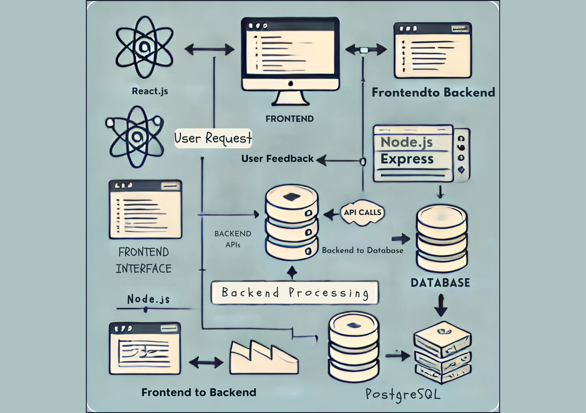

# Design Documents

---

## Overview

This directory contains the design documentation for the project, including architecture diagrams, design decisions, and technical specifications. These documents serve as a blueprint for the development process and provide insights into the system’s architecture, design patterns, and key technical decisions.

## Contents

- **`architecture_diagram.png`**: A visual representation of the system's architecture, depicting the interaction between the frontend, backend, and database components.
- **`technical_specifications.md`**: Detailed technical specifications, including the technology stack, component descriptions, design decisions, and system requirements.

---

## Architecture Diagram

The architecture diagram (`architecture_diagram.png`) provides a high-level view of the system's structure. It illustrates how different components interact with each other, ensuring that both developers and stakeholders have a clear understanding of the system's flow.

## Technical Specifications

The technical specifications document (`technical_specifications.md`) delves into the specific details of each component in the system. It covers everything from the choice of technology stack to the rationale behind key design decisions, ensuring that the system is built on a solid foundation.

---

## Contribution Guidelines

We welcome contributions to the design documents. If you have suggestions for improvements or new design elements, please follow the contribution guidelines in our [CONTRIBUTING.md](https://github.com/your-org/your-repo-name/blob/main/CONTRIBUTING.md).

## License

This project is licensed under the MIT License - see the [LICENSE](https://github.com/your-org/your-repo-name/blob/main/LICENSE) file for details.

---

## Additional Resources

For more information on the technologies used in this project, please refer to the following resources:

- [React.js Documentation](https://reactjs.org/docs/getting-started.html)
- [Node.js Documentation](https://nodejs.org/en/docs/)
- [PostgreSQL Documentation](https://www.postgresql.org/docs/)

---

## Contact

For any questions or further information, please open an issue on the [GitHub repository](https://github.com/your-org/your-repo-name/issues) or contact the project maintainer at [email@example.com](mailto:email@example.com).
