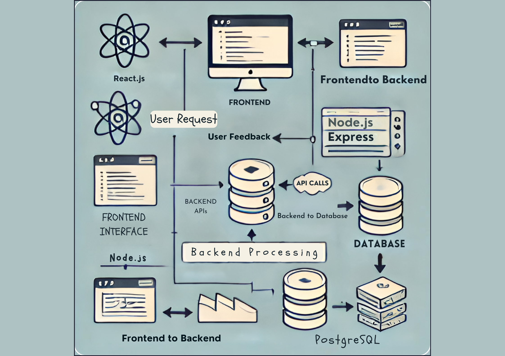

# Architecture Diagram Explained

---

## Overview

This document provides a detailed explanation of the system architecture diagram for our web application. The diagram illustrates the interaction between the frontend, backend, and database components, along with the communication flows that facilitate data exchange between them.

---

## Components

### 1. **Frontend (React.js)**

- **Representation**: The frontend is depicted as a computer icon labeled "Frontend (React.js)" and is responsible for rendering the user interface and handling user interactions.
- **Description**:
  - The frontend is built using React.js, a popular JavaScript library for creating dynamic and responsive user interfaces. It manages the presentation layer, displaying data to users and collecting inputs, which are then sent to the backend for processing.

### 2. **Backend API (Node.js, Express)**

- **Representation**: The backend API is represented by a server icon labeled "Backend API (Node.js, Express)".
- **Description**:
  - The backend API serves as the intermediary between the frontend and the database. It is responsible for processing incoming requests from the frontend, applying business logic, and interacting with the database to retrieve or store data.
  - The backend is built using Node.js, a JavaScript runtime, and Express.js, a web application framework that simplifies the creation of APIs.

### 3. **Database (PostgreSQL)**

- **Representation**: The database is depicted as a stack of disks labeled "Database (PostgreSQL)".
- **Description**:
  - The database stores all persistent data, including user information, application logs, and other critical data. PostgreSQL is used for its robustness, advanced features, and ability to handle complex queries.

---

## Communication Flows

### 1. **User Request and User Feedback**

- **Flow Description**:
  - The diagram shows a bidirectional arrow labeled "User Request" and "User Feedback" between the user interface (frontend) and the backend API.
  - **Process**:
    - When a user interacts with the frontend (e.g., submitting a form), a "User Request" is sent to the backend API. The backend processes the request and returns a response, which is then rendered as "User Feedback" on the frontend.

### 2. **Frontend to Backend**

- **Flow Description**:
  - The diagram includes arrows labeled "Frontend to Backend," representing the flow of requests from the frontend to the backend API.
  - **Process**:
    - The frontend sends HTTP requests (e.g., GET, POST) to the backend API to perform actions such as retrieving data or submitting user input. The backend API processes these requests and returns the necessary data or confirmation of the action.

### 3. **Backend to Database**

- **Flow Description**:
  - The diagram shows arrows labeled "Backend to Database" and "API Calls" between the backend API and the database.
  - **Process**:
    - The backend API communicates with the PostgreSQL database to perform CRUD (Create, Read, Update, Delete) operations. It sends SQL queries to the database, which processes the queries and returns the results to the backend API.

---

## Data Flow Example

Here is an example of how data flows through the system:

1. **User Interaction**:
   - A user fills out a form on the frontend and clicks "Submit".
2. **Frontend to Backend**:
   - The frontend sends an HTTP POST request to the backend API, including the data from the form.
3. **Backend Processing**:
   - The backend API validates the data, applies any necessary business logic, and prepares a SQL query to insert the data into the database.
4. **Backend to Database**:
   - The backend API sends the SQL query to PostgreSQL, which processes the insertion of the new data.
5. **Response Flow**:
   - PostgreSQL confirms the data insertion, and the backend API sends a success response back to the frontend.
6. **User Feedback**:
   - The frontend updates the user interface to show that the form was successfully submitted.

---

## Conclusion

This architecture diagram provides a clear visualization of how the frontend, backend, and database components interact within the web application. Understanding these components and their communication flows is essential for maintaining, scaling, and extending the system. This document serves as a reference for developers and stakeholders to comprehend the system's structure and data flow processes.

For more details or to contribute to this project, please visit the [GitHub repository](https://github.com/your-org/your-repo-name).

---
